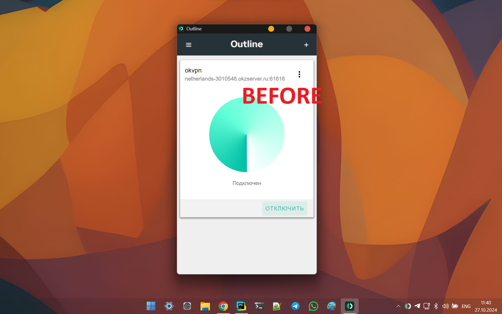
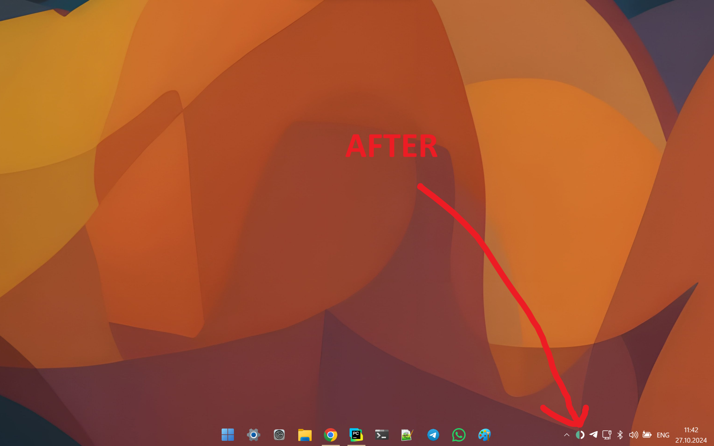

Simple program to Hide Outline VPN window on Windows startup
==
On Startup:
--

After 1 second:
--

Program run 10 sec, and try to minimise Outline VPN window by "Outline" window title.

You need add link to "dist/outline-window-hide.exe" to Autorun Startup folder (google it)